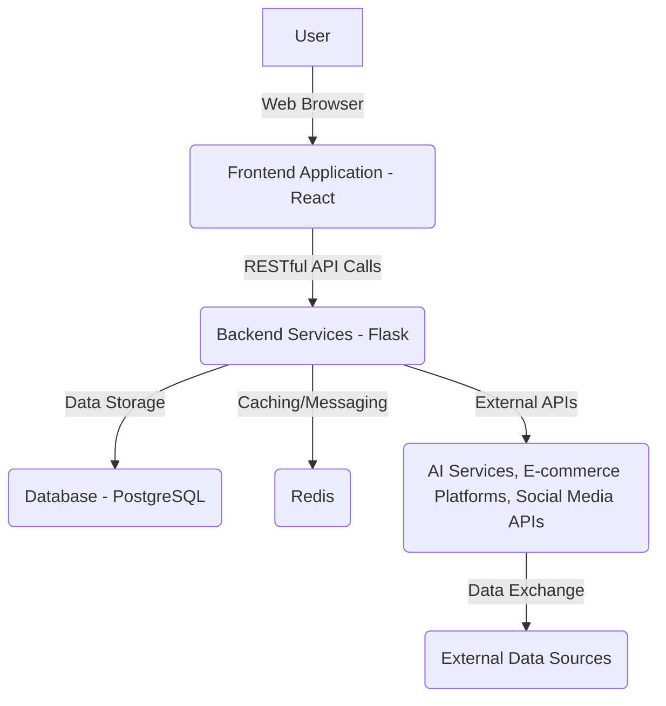

# KSAP E-commerce Management Platform: Project Requirements Document

## 1. Project Overview

KSAP (Komprehensive Store Administration Platform) is envisioned as a cutting-edge, all-in-one e-commerce management solution designed to empower businesses and individual entrepreneurs to efficiently manage multiple online stores from a single, intuitive interface. Leveraging modern web technologies and advanced AI capabilities, KSAP aims to streamline various aspects of e-commerce operations, from initial store setup and market research to order fulfillment, payment processing, and sophisticated advertising campaigns. The platform will provide a robust, secure, and scalable environment, ensuring optimal performance and data integrity for its users.

This document outlines the comprehensive requirements for the development of KSAP, serving as a foundational guide for all contributing agents and developers. It details the core functionalities, technical specifications, security considerations, and deployment strategies necessary to bring this ambitious project to fruition. The ultimate goal is to deliver a highly robust, user-friendly, and feature-rich application that sets a new standard in e-commerce management.

## 2. Goals and Objectives

The primary goal of KSAP is to provide a centralized, efficient, and intelligent platform for managing diverse e-commerce operations across multiple online stores. This overarching goal is supported by several key objectives:

### 2.1. Multi-Store Management

*   **Objective:** Enable users to manage multiple e-commerce stores from a single, intuitive dashboard.
*   **Requirement:** Implement a card-based interface where each card represents a distinct store, allowing for quick access and overview.
*   **Requirement:** Upon opening a store card, provide a dedicated interface for managing all aspects of that specific store.

### 2.2. Store Setup and Domain Registration

*   **Objective:** Simplify the initial setup process for new e-commerce stores.
*   **Requirement:** Provide tools and guidance for store setup across common e-commerce platforms (e.g., Shopify, WooCommerce, Magento).
*   **Requirement:** Integrate with domain registration services, offering price comparisons for various domain providers.

### 2.3. Market Research and Competitive Analysis

*   **Objective:** Equip users with advanced market intelligence to inform their business strategies.
*   **Requirement:** Develop a built-in 'Kalodata clone' functionality to gather data from common sources, including competitor advertising campaigns.
*   **Requirement:** Enable users to view and analyze ads run by competitors across various platforms.

### 2.4. Site Management Integration

*   **Objective:** Facilitate seamless management of e-commerce sites built on popular platforms.
*   **Requirement:** Provide robust integration with Shopify and other leading shop management systems (e.g., BigCommerce, Squarespace).
*   **Requirement:** Allow users to manage product listings, inventory, store themes, and other site-specific configurations directly from KSAP.

### 2.5. Order Fulfillment

*   **Objective:** Streamline the order fulfillment process for all managed stores.
*   **Requirement:** Enable users to view, process, and fulfill orders directly within the KSAP application.
*   **Requirement:** Integrate with common shipping carriers and logistics providers to automate shipping label generation and tracking.

### 2.6. Payment Processor Management

*   **Objective:** Centralize the management of various payment gateways.
*   **Requirement:** Allow users to configure, monitor, and manage their payment processors (e.g., Stripe, PayPal, Square) from within KSAP.
*   **Requirement:** Provide insights into transaction data, payout schedules, and dispute resolution.

### 2.7. AI-Agentic Ad Creation System

*   **Objective:** Empower users to create high-performing advertising creatives using advanced AI.
*   **Requirement:** Integrate Gemini 2.5 Pro for in-depth market research and trend analysis to inform ad content.
*   **Requirement:** Utilize GPT for image generation, producing compelling visuals for ad campaigns.
*   **Requirement:** Leverage Claude for copywriting, generating persuasive and engaging ad text.
*   **Requirement:** Develop a user-friendly interface for guiding the AI ad creation process and reviewing generated creatives.

### 2.8. VPN, Proxy, and Social Media Ad Management

*   **Objective:** Provide tools for secure and effective social media advertising, including multi-account management.
*   **Requirement:** Allow users to manage VPN and proxy settings for secure access to social media platforms (Facebook, Instagram, etc.).
*   **Requirement:** Enable direct ad campaign management from within KSAP for platforms like Facebook and Instagram.
*   **Requirement:** Facilitate the creation and management of multiple Facebook accounts, including recommendations for warm-up routes and estimated costs.

### 2.9. Detailed Analytics

*   **Objective:** Offer comprehensive and actionable insights into store performance and marketing efforts.
*   **Requirement:** Implement robust analytics dashboards providing detailed data on sales, traffic, customer behavior, ad performance, and more.
*   **Requirement:** Ensure data visualization is clear, customizable, and supports data-driven decision-making.

### 2.10. Robustness, Security, and Open Source Principles

*   **Objective:** Build a highly stable, secure, and maintainable application.
*   **Requirement:** Utilize open-source, stable boilerplate code and adhere to industry-standard coding practices and paradigms.
*   **Requirement:** Implement all necessary security measures, including data encryption, secure authentication, and protection against common web vulnerabilities.
*   **Requirement:** Ensure clean, well-commented code to facilitate collaboration and future development by other agents and human developers.

## 3. Technical Specifications and Architecture Design

KSAP will be developed as a modern, scalable, and maintainable web application following a microservices-oriented architecture. This approach will ensure modularity, independent deployability, and resilience. The application will consist of a robust backend API, a dynamic frontend user interface, and a scalable database system.

### 3.1. Overall Architecture

The system will adopt a decoupled architecture, separating the frontend presentation layer from the backend business logic and data management. Communication between the frontend and backend will primarily occur via RESTful APIs. Individual services within the backend will communicate via internal APIs or message queues.

**Diagram 1: High-Level System Architecture**

### 3.2. Technology Stack Selection

To ensure robustness, scalability, and adherence to industry best practices, the following technology stack has been selected:

*   **Frontend:** React.js (with Next.js for server-side rendering and routing, if applicable for performance/SEO needs), Redux Toolkit for state management, Tailwind CSS for styling, and Jest/React Testing Library for testing.
*   **Backend:** Python with Flask (or FastAPI for higher performance, if benchmarks indicate necessity) for API development. SQLAlchemy for ORM, Marshmallow for serialization/deserialization, and Celery for asynchronous tasks.
*   **Database:** PostgreSQL for relational data storage, chosen for its robustness, extensibility, and ACID compliance. Redis for caching, session management, and message brokering.
*   **Version Control:** Git and GitHub, with a clear branching strategy (e.g., GitFlow or GitHub Flow).
*   **Containerization:** Docker for consistent development, testing, and deployment environments.
*   **Deployment:** Kubernetes for orchestration (if microservices scale warrants it), otherwise simpler container deployment on cloud platforms (e.g., AWS ECS, Google Cloud Run).
*   **Testing:** Unit tests, integration tests, and end-to-end tests for both frontend and backend components.

### 3.3. Backend API Design

The backend will be developed as a set of independent microservices, each responsible for a specific domain (e.g., User Management, Store Management, Order Fulfillment, Analytics, AI Services). This will allow for independent scaling and development.

*   **API Standard:** RESTful API principles, using JSON for request and response bodies.
*   **Authentication:** OAuth 2.0 and JWT (JSON Web Tokens) for secure API authentication and authorization.
*   **Error Handling:** Consistent and informative error responses with appropriate HTTP status codes.
*   **Logging & Monitoring:** Centralized logging (e.g., ELK stack or Prometheus/Grafana) for effective monitoring and debugging.

### 3.4. Frontend Application Design

The frontend will be a single-page application (SPA) built with React, providing a highly interactive and responsive user experience. The design will prioritize usability and intuitive navigation.

*   **Component-Based:** Modular and reusable React components for UI elements.
*   **Responsive Design:** Optimized for various screen sizes and devices (desktop, tablet, mobile) using a mobile-first approach.
*   **State Management:** Redux Toolkit for predictable state management across the application.
*   **Routing:** React Router for client-side routing.

### 3.5. Database Schema Requirements

The database schema will be designed to support the complex relationships between users, stores, products, orders, and various integrations. It will be normalized to ensure data integrity and optimized for performance.

*   **Key Entities:** Users, Stores, Products, Orders, Customers, Integrations (Shopify, Payment Processors, AI Services), Ad Campaigns, Analytics Data.
*   **Relationships:** Clearly defined relationships between entities (one-to-many, many-to-many).
*   **Indexing:** Appropriate indexing for frequently queried columns to optimize read performance.
*   **Migrations:** Database schema changes will be managed using Alembic (for SQLAlchemy) to ensure smooth updates.

## 4. Detailed Feature Specifications

This section elaborates on the specific functionalities and requirements for each core module of the KSAP platform.

### 4.1. Multi-Store Management Module

This module is the central hub for users to oversee all their e-commerce ventures. It provides a high-level overview and quick access to individual store management interfaces.

*   **4.1.1. Store Dashboard (Card View):**
    *   **Description:** A primary dashboard displaying each managed store as an interactive card.
    *   **Requirements:**
        *   Each card should visually represent a store (e.g., store logo, name).
        *   Cards should display key metrics at a glance (e.g., total sales, active orders, recent activity, status).
        *   Clicking a card navigates the user to the detailed management interface for that specific store.
        *   Ability to add new stores from the dashboard.
        *   Ability to reorder or group store cards for better organization.
*   **4.1.2. Store Creation/Onboarding Workflow:**
    *   **Description:** A guided process for adding new e-commerce stores to KSAP.
    *   **Requirements:**
        *   Step-by-step wizard for connecting existing stores or initiating new store setups.
        *   Require credentials or API keys for integration with external platforms (e.g., Shopify API key).
        *   Validation of provided integration details.

### 4.2. Store Setup and Domain Registration Module

This module assists users in the foundational steps of establishing an online presence.

*   **4.2.1. E-commerce Platform Setup Guidance:**
    *   **Description:** Provide resources and guided steps for setting up stores on popular platforms.
    *   **Requirements:**
        *   Checklists and tutorials for Shopify, WooCommerce, Magento, BigCommerce, etc.
        *   Links to official documentation and best practices for each platform.
*   **4.2.2. Domain Registration and Comparison:**
    *   **Description:** Facilitate domain name search, registration, and price comparison.
    *   **Requirements:**
        *   Search bar for checking domain name availability.
        *   Integration with multiple domain registrars (e.g., GoDaddy, Namecheap, Google Domains).
        *   Display comparative pricing for available domains across different registrars.
        *   Option to initiate domain registration directly through KSAP (via API integration or guided external process).
        *   DNS management assistance (e.g., pointing domain to e-commerce platform).

### 4.3. Market Research and Competitive Analysis Module

This module provides intelligence on market trends and competitor strategies, akin to a 'Kalodata clone'.

*   **4.3.1. Ad Spy/Competitor Ad Analysis:**
    *   **Description:** Allow users to discover and analyze advertising campaigns run by competitors.
    *   **Requirements:**
        *   Search functionality for ads based on keywords, industry, competitor names, or ad platform.
        *   Display ad creatives (images, videos), ad copy, target audience insights (if available), and ad spend estimates.
        *   Filter and sort ads by platform (Facebook, Instagram, Google, TikTok, etc.), date, and performance metrics.
        *   Ability to save and categorize interesting ads for future reference.
        *   Data collection from publicly available ad libraries and ad intelligence platforms (requires robust scraping or API integrations).
*   **4.3.2. Trend Analysis and Product Research:**
    *   **Description:** Identify trending products, niches, and market opportunities.
    *   **Requirements:**
        *   Integration with product research tools (e.g., Google Trends, Amazon Best Sellers, AliExpress).
        *   Display data on product demand, competition, and potential profitability.
        *   Generate reports on market size, consumer demographics, and emerging trends.

### 4.4. Site Management Integration Module

This module provides a unified interface for managing the operational aspects of integrated e-commerce sites.

*   **4.4.1. Product and Inventory Management:**
    *   **Description:** Manage product listings, descriptions, images, pricing, and inventory levels.
    *   **Requirements:**
        *   Synchronize product data with integrated platforms (Shopify, etc.).
        *   Bulk editing capabilities for product attributes.
        *   Real-time inventory tracking and low-stock alerts.
        *   Support for product variants and SKUs.
*   **4.4.2. Theme and Design Management (Basic):**
    *   **Description:** Basic capabilities to manage store themes and design elements.
    *   **Requirements:**
        *   View active theme and installed themes.
        *   Option to switch themes (if supported by platform API).
        *   Links to platform-specific theme customization interfaces.
*   **4.4.3. Page and Content Management (Basic):**
    *   **Description:** Basic management of static pages and blog posts.
    *   **Requirements:**
        *   View existing pages/posts.
        *   Links to platform-specific content editors.

### 4.5. Order Fulfillment Module

This module centralizes order processing and fulfillment, reducing manual effort.

*   **4.5.1. Order Dashboard:**
    *   **Description:** A comprehensive view of all orders across all integrated stores.
    *   **Requirements:**
        *   Filter orders by status (pending, fulfilled, shipped, cancelled), store, date range, customer.
        *   Display order details: customer information, items purchased, total amount, shipping address.
        *   Bulk actions: fulfill multiple orders, print packing slips/labels.
*   **4.5.2. Fulfillment Workflow:**
    *   **Description:** Guided process for marking orders as fulfilled and generating shipping labels.
    *   **Requirements:**
        *   Integration with major shipping carriers (e.g., USPS, FedEx, UPS, DHL) for real-time rates and label generation.
        *   Automatic tracking number generation and synchronization with e-commerce platforms.
        *   Email notifications to customers upon fulfillment and shipping.
        *   Support for partial fulfillment.

### 4.6. Payment Processor Management Module

This module provides a consolidated view and management interface for various payment gateways.

*   **4.6.1. Payment Gateway Integration:**
    *   **Description:** Connect and manage accounts with popular payment processors.
    *   **Requirements:**
        *   Support for Stripe, PayPal, Square, and other common gateways.
        *   Secure storage of API keys and credentials.
*   **4.6.2. Transaction Monitoring and Reporting:**
    *   **Description:** View transaction history and generate financial reports.
    *   **Requirements:**
        *   Dashboard showing daily/weekly/monthly transaction volumes, successful payments, refunds, disputes.
        *   Detailed transaction logs with search and filter capabilities.
        *   Exportable reports (CSV, PDF) for accounting purposes.
*   **4.6.3. Payout Management:**
    *   **Description:** Track payout schedules and amounts from payment processors.
    *   **Requirements:**
        *   Display upcoming and past payouts.
        *   Alerts for delayed or failed payouts.

### 4.7. AI-Agentic Ad Creation System Module

This module leverages advanced AI models to assist users in generating compelling advertising creatives.

*   **4.7.1. Ad Campaign Briefing Interface:**
    *   **Description:** A form for users to input their ad campaign objectives, target audience, product details, and desired tone.
    *   **Requirements:**
        *   Structured input fields for all necessary ad parameters.
        *   Guidance and examples for effective briefing.
*   **4.7.2. AI-Powered Research (Gemini 2.5 Pro):**
    *   **Description:** Utilize Gemini 2.5 Pro to conduct market research based on the briefing.
    *   **Requirements:**
        *   Analyze current trends, competitor ads, and audience demographics.
        *   Generate insights and recommendations for ad angles, keywords, and visual styles.
        *   Output research summaries and data points.
*   **4.7.3. Image Generation (GPT):**
    *   **Description:** Generate high-quality ad images based on research insights and user preferences.
    *   **Requirements:**
        *   Input research findings and textual descriptions to GPT for image synthesis.
        *   Provide options for image style, composition, and variations.
        *   Allow users to review and select generated images.
        *   Support for various aspect ratios suitable for different ad platforms.
*   **4.7.4. Copywriting (Claude):**
    *   **Description:** Generate persuasive and engaging ad copy for various platforms.
    *   **Requirements:**
        *   Input research findings, product benefits, and target audience to Claude.
        *   Generate headlines, primary text, and calls-to-action (CTAs).
        *   Offer different tones (e.g., urgent, informative, humorous) and lengths.
        *   Allow users to refine and edit generated copy.
*   **4.7.5. Creative Review and Export:**
    *   **Description:** A unified interface to review generated ad creatives (image + copy).
    *   **Requirements:**
        *   Preview ad creatives as they would appear on different platforms.
        *   Option to make final edits to images and copy.
        *   Export creatives in suitable formats for ad platform upload.

### 4.8. VPN, Proxy, and Social Media Ad Management Module

This module provides tools for secure social media advertising and multi-account management.

*   **4.8.1. VPN/Proxy Configuration:**
    *   **Description:** Allow users to configure and manage VPN and proxy settings within the application.
    *   **Requirements:**
        *   Input proxy details (IP, port, username, password).
        *   Test proxy connectivity.
        *   Associate proxies with specific social media accounts or campaigns.
        *   Recommendations for reputable proxy providers.
*   **4.8.2. Social Media Account Management:**
    *   **Description:** Manage multiple Facebook, Instagram, and other social media accounts.
    *   **Requirements:**
        *   Securely store account credentials (encrypted).
        *   Dashboard for viewing account status, linked pages/profiles.
        *   Guidance on account warm-up strategies to avoid bans.
        *   Estimated costs associated with account creation and warm-up.
*   **4.8.3. Direct Ad Campaign Management:**
    *   **Description:** Create, manage, and monitor ad campaigns directly on Facebook/Instagram.
    *   **Requirements:**
        *   Integration with Facebook Ads API and Instagram Graph API.
        *   Campaign creation interface: objective, budget, schedule, audience targeting.
        *   Ad set and ad creation: link creatives from AI system, define placements.
        *   Real-time campaign performance monitoring (impressions, clicks, conversions, spend).
        *   Pause/resume campaigns, adjust budgets.

### 4.9. Detailed Analytics Module

This module provides comprehensive insights into store performance, marketing effectiveness, and overall business health.

*   **4.9.1. Customizable Dashboards:**
    *   **Description:** Users can create and customize their analytics dashboards.
    *   **Requirements:**
        *   Drag-and-drop interface for adding/removing widgets.
        *   Pre-built templates for common analytics views (e.g., Sales Overview, Marketing Performance, Customer Demographics).
*   **4.9.2. Key Performance Indicators (KPIs):**
    *   **Description:** Display essential metrics for e-commerce operations.
    *   **Requirements:**
        *   Sales: Revenue, Average Order Value (AOV), Conversion Rate, Sales by Product/Category.
        *   Traffic: Website Visitors, Page Views, Bounce Rate, Traffic Sources.
        *   Customer: New vs. Returning Customers, Customer Lifetime Value (CLTV), Customer Acquisition Cost (CAC).
        *   Marketing: Ad Spend, ROI, CPA, Click-Through Rate (CTR), Impressions.
        *   Inventory: Stock Levels, Product Performance.
*   **4.9.3. Data Visualization:**
    *   **Description:** Present data using various interactive charts and graphs.
    *   **Requirements:**
        *   Line charts for trends over time.
        *   Bar charts for comparisons.
        *   Pie charts for distributions.
        *   Geographical maps for sales by region.
        *   Ability to drill down into data.
*   **4.9.4. Reporting and Export:**
    *   **Description:** Generate and export detailed reports.
    *   **Requirements:**
        *   Scheduled report generation.
        *   Export data to CSV, Excel, PDF formats.
        *   Customizable report templates.

## 5. Security Requirements

Security is paramount for KSAP, given its handling of sensitive e-commerce data, financial information, and access to various external platforms. The application will be designed and developed with a security-first mindset, adhering to industry best practices and standards.

### 5.1. Data Security and Privacy

*   **5.1.1. Encryption:**
    *   **Requirement:** All sensitive data at rest (e.g., API keys, credentials, payment information, personal user data) MUST be encrypted using strong, industry-standard encryption algorithms (e.g., AES-256).
    *   **Requirement:** All data in transit (between frontend and backend, and between backend and external APIs) MUST be encrypted using TLS/SSL (HTTPS).
*   **5.1.2. Data Minimization:**
    *   **Requirement:** Collect and store only the data absolutely necessary for the application's functionality.
*   **5.1.3. Data Retention:**
    *   **Requirement:** Define and implement clear data retention policies, ensuring data is not stored longer than necessary.
*   **5.1.4. Privacy by Design:**
    *   **Requirement:** Incorporate privacy considerations into every stage of the development process.

### 5.2. Authentication and Authorization

*   **5.2.1. Strong Authentication:**
    *   **Requirement:** Implement robust user authentication mechanisms, including multi-factor authentication (MFA) support.
    *   **Requirement:** Secure password storage using strong hashing algorithms (e.g., bcrypt) with appropriate salt.
*   **5.2.2. Role-Based Access Control (RBAC):**
    *   **Requirement:** Implement a granular RBAC system to ensure users only have access to the functionalities and data relevant to their roles.
    *   **Requirement:** Clearly define roles (e.g., Admin, Store Manager, Viewer) and their associated permissions.
*   **5.2.3. Session Management:**
    *   **Requirement:** Implement secure session management, including short-lived JWTs, token revocation, and protection against session hijacking.

### 5.3. Application Security

*   **5.3.1. Input Validation and Sanitization:**
    *   **Requirement:** All user inputs MUST be rigorously validated and sanitized to prevent common web vulnerabilities such as SQL Injection, Cross-Site Scripting (XSS), and Command Injection.
*   **5.3.2. API Security:**
    *   **Requirement:** Implement API rate limiting to prevent abuse and denial-of-service attacks.
    *   **Requirement:** Use secure API key management practices.
*   **5.3.3. Error Handling and Logging:**
    *   **Requirement:** Implement comprehensive error handling to prevent information leakage through verbose error messages.
    *   **Requirement:** Centralized logging of security-relevant events for auditing and incident response.
*   **5.3.4. Dependency Management:**
    *   **Requirement:** Regularly scan and update third-party libraries and dependencies to mitigate known vulnerabilities.
*   **5.3.5. Secure Coding Practices:**
    *   **Requirement:** Adhere to secure coding guidelines (e.g., OWASP Top 10) throughout the development lifecycle.

### 5.4. Infrastructure Security

*   **5.4.1. Network Security:**
    *   **Requirement:** Implement network segmentation and firewall rules to restrict access to critical components.
*   **5.4.2. Regular Security Audits and Penetration Testing:**
    *   **Requirement:** Conduct periodic security audits and penetration testing to identify and address vulnerabilities.
*   **5.4.3. Backup and Disaster Recovery:**
    *   **Requirement:** Implement robust backup and disaster recovery plans to ensure data availability and business continuity.

## 6. Development Roadmap and Milestone Definitions

The development of KSAP will follow an agile methodology, with iterative development cycles and continuous integration. The project will be broken down into distinct phases, each with defined milestones to track progress and ensure timely delivery.

### 6.1. Phases and Milestones

*   **Phase 1: Project Planning and Documentation (Current Phase)**
    *   **Objective:** Establish a clear understanding of project scope, requirements, and foundational documentation.
    *   **Milestones:**
        *   Comprehensive Project Requirements Document (this document) completed.
        *   Initial `todo.md` file created and populated.
        *   High-level architecture design outlined.
        *   Technology stack selected.

*   **Phase 2: Architecture Design and Technology Stack Selection**
    *   **Objective:** Finalize the system architecture, detailed technology choices, and foundational design documents.
    *   **Milestones:**
        *   Detailed microservices architecture design completed.
        *   Final technology stack justification and selection document.
        *   System architecture diagrams (e.g., Mermaid diagrams) finalized.
        *   API endpoint design and data flow established.
        *   Database design and relationships fully planned.
        *   Authentication and authorization system design completed.
        *   Deployment and DevOps strategy outlined.

*   **Phase 3: Backend API Development and Database Setup**
    *   **Objective:** Develop the core backend services and establish the database infrastructure.
    *   **Milestones:**
        *   Flask application structure initialized.
        *   Database models and migrations implemented.
        *   Authentication and authorization middleware developed.
        *   Core API endpoints for user and store management implemented.
        *   Redis integrated for caching and sessions.
        *   Basic rate limiting and security measures in place.
        *   Unit tests for core backend functionalities.

*   **Phase 4: Frontend React Application Development**
    *   **Objective:** Develop the foundational frontend application and core UI components.
    *   **Milestones:**
        *   React application initialized with modern tooling.
        *   Responsive UI components developed.
        *   Store management dashboard structure implemented.
        *   Routing and state management (Redux Toolkit) configured.
        *   Card-based store interface designed and implemented.
        *   Reusable component library initiated.
        *   Frontend unit tests.

*   **Phase 5: Core E-commerce Features Implementation**
    *   **Objective:** Implement the primary e-commerce management functionalities.
    *   **Milestones:**
        *   Store setup and domain registration module functional.
        *   Market research and competitor analysis tools (basic functionality) implemented.
        *   Shopify and other shop manager integrations (initial phase) completed.
        *   Order fulfillment module (basic order viewing and status update) implemented.
        *   Payment processor management (connection and basic transaction view) implemented.
        *   Basic analytics dashboard with key metrics.

*   **Phase 6: AI Integration and External API Connections**
    *   **Objective:** Integrate advanced AI capabilities and connect to external e-commerce and social media APIs.
    *   **Milestones:**
        *   Gemini 2.5 Pro integration for market research.
        *   GPT integration for image generation.
        *   Claude integration for copywriting.
        *   VPN and proxy management system functional.
        *   Facebook/Instagram API integrations for ad management.
        *   Social media account management tools implemented.

*   **Phase 7: Security Implementation and Testing**
    *   **Objective:** Ensure the application meets high security standards through comprehensive implementation and testing.
    *   **Milestones:**
        *   All security requirements (data encryption, input validation, etc.) implemented.
        *   Comprehensive security testing and vulnerability assessment completed.
        *   Monitoring and logging systems fully configured.
        *   Backup and disaster recovery procedures defined and tested.
        *   Error handling mechanisms robustly implemented.

*   **Phase 8: Documentation and Deployment Preparation**
    *   **Objective:** Finalize all project documentation and prepare the application for deployment and ongoing maintenance.
    *   **Milestones:**
        *   Complete API documentation generated.
        *   User manuals and guides created.
        *   CI/CD pipeline set up and tested.
        *   Deployment configurations finalized.
        *   Maintenance and monitoring procedures documented.
        *   Final project handover documentation prepared.
        *   Application deployed to GitHub repository.

